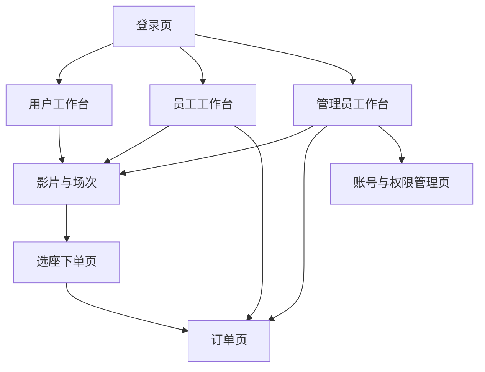

## 1. Product Overview
cinema-frontend 是一个影院业务前端（含用户端与管理端），用于完成影片浏览、选座购票与后台管理。
系统严格遵循你提供的截图视觉与布局规范，并通过三角色路由与权限分流对接既有后端 API。

## 2. Core Features

### 2.1 User Roles
| 角色 | 注册/登录方式 | 核心权限 |
|------|---------------|----------|
| 普通用户 | 账号密码登录（由后端鉴权） | 浏览影片与场次、在线选座下单、查看/取消订单、维护个人信息 |
| 影院员工 | 账号密码登录（由后端分配） | 管理影片与场次、查看订单与检票/核销、查看基础统计 |
| 系统管理员 | 账号密码登录（由后端分配） | 具备员工全部权限；额外可管理用户/员工账号与角色、查看全量统计 |

### 2.2 Feature Module
本产品最小可用需求包含以下页面：
1. **登录页**：账号密码登录、错误提示、按角色自动分流到对应工作台。
2. **工作台（通用控制台布局）**：严格按截图的“侧边栏 + 顶部栏 + 内容区”结构，承载各角色菜单与子页面容器。
3. **影片与场次（列表/维护）**：影片列表查询与维护；场次列表查询与维护；用于支撑用户选座。
4. **选座下单页**：选择场次、展示座位图、提交订单。
5. **订单页**：用户查看/取消订单；员工查看订单并进行核销；管理员查看全量订单。
6. **账号与权限管理页（管理员）**：用户/员工列表、角色分配与启停用。

### 2.3 Page Details
| Page Name | Module Name | Feature description |
|-----------|-------------|---------------------|
| 登录页 | 登录表单 | 输入账号/密码并调用后端登录接口；成功后写入 token 与 role 并跳转到对应角色工作台 |
| 登录页 | 错误与状态 | 显示登录失败原因（如密码错误/无权限/账号停用）；按钮 loading 防重复提交 |
| 工作台（通用控制台布局） | 侧边栏菜单 | 按截图样式渲染 Logo/系统名与菜单；根据 role 仅显示允许的菜单项 |
| 工作台（通用控制台布局） | 顶部栏 | 按截图样式显示面包屑/标题区与用户信息下拉（退出登录） |
| 工作台（通用控制台布局） | 内容容器 | 作为路由 Outlet；统一容器间距、卡片/表格样式与空状态 |
| 影片与场次（列表/维护） | 影片管理 | 列表展示影片核心字段；支持按关键字/状态查询；支持新增/编辑/上下架（调用后端 API） |
| 影片与场次（列表/维护） | 场次管理 | 列表展示场次（影片/影厅/时间/价格/剩余座位）；支持新增/编辑/停用（调用后端 API） |
| 选座下单页 | 场次选择 | 从影片进入后选择场次；加载场次可售座位信息 |
| 选座下单页 | 座位图与交互 | 展示座位矩阵；区分可选/已售/已选；限制选座数量；实时计算金额 |
| 选座下单页 | 提交订单 | 调用后端创建订单接口；成功跳转订单页；失败提示原因（座位被抢等） |
| 订单页 | 用户订单 | 列表展示订单状态；支持查看详情与取消未支付/未核销订单（按后端规则） |
| 订单页 | 核销/检票（员工/管理员） | 查询订单并执行核销动作；展示核销结果与时间 |
| 账号与权限管理页（管理员） | 账号列表 | 查看用户/员工账号；按关键字/角色筛选 |
| 账号与权限管理页（管理员） | 角色与状态 | 分配/变更角色；启用/停用账号（调用后端 API） |

## 3. Core Process
- 普通用户流程：进入登录页登录 → 进入用户工作台 → 浏览影片与选择场次 → 进入选座下单 → 提交订单 → 在订单页查看/取消。
- 影院员工流程：登录 → 进入员工工作台 → 维护影片/场次（如有权限） → 在订单页查询订单并核销。
- 系统管理员流程：登录 → 进入管理员工作台 → 进行影片/场次/订单全量管理 → 进入账号与权限管理分配角色与停启用。

