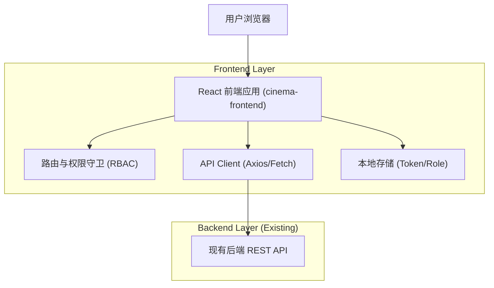

## 1.Architecture design

## 2.Technology Description
- Frontend: React@18 + TypeScript + vite
- UI: antd（使用其 Layout/Menu/Table/Form 等以匹配截图式控制台结构）
- Router: react-router-dom@6（嵌套路由 + Outlet）
- Data Fetching: axios（统一 baseURL、拦截器、错误处理）
- State: 轻量全局状态（如 zustand）或 React Context（保存登录态/角色/用户信息）

## 3.Route definitions
| Route | Purpose |
|-------|---------|
| /login | 登录页；完成鉴权后按 role 分流 |
| /u | 普通用户工作台根路由（受保护） |
| /u/movies | 用户：影片与场次浏览入口 |
| /u/booking/:showId | 用户：选座下单页 |
| /u/orders | 用户：订单列表/取消 |
| /staff | 影院员工工作台根路由（受保护） |
| /staff/movies | 员工：影片管理（有权限才显示/可访问） |
| /staff/shows | 员工：场次管理（有权限才显示/可访问） |
| /staff/orders | 员工：订单查询与核销 |
| /admin | 系统管理员工作台根路由（受保护） |
| /admin/movies | 管理员：影片管理 |
| /admin/shows | 管理员：场次管理 |
| /admin/orders | 管理员：订单管理 |
| /admin/accounts | 管理员：账号与权限管理 |

权限与分流规则（前端实现要点）：
- 登录成功后后端返回 token 与 role（user/staff/admin）；前端写入本地存储并刷新全局登录态。
- 路由守卫：
  - 未登录访问任何受保护路由 → 重定向 /login。
  - 已登录但 role 不匹配的路由 → 重定向到对应角色根路由（/u 或 /staff 或 /admin）或展示 403 页面（若项目已有）。
- 菜单与路由双重控制：侧边栏只渲染允许项；同时对所有受保护 route 做 role 校验，避免仅靠隐藏菜单造成越权。
